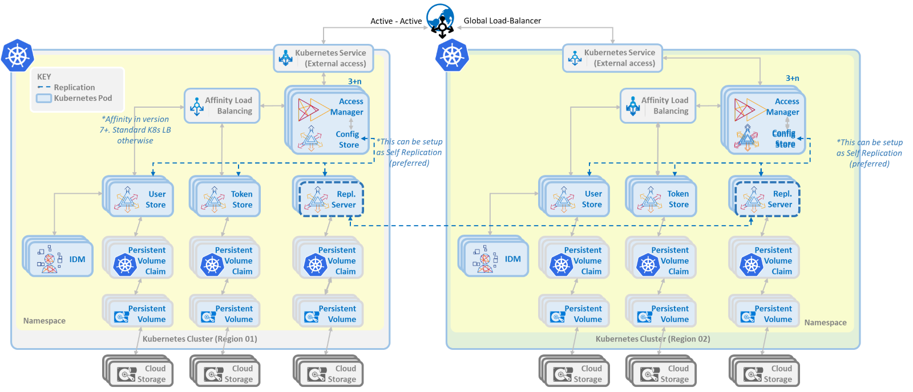

<!--
# =====================================================================
# Midships Limited
# Copyright (c) 2023
# This file contains scripts/code owned by Midships Limited
#
# NOTE: Don't check this file into source control with any sensitive hard coded value.
# 
# Legal Notice: Installation and use of this script is subject to
# a license agreement with Midships Limited (a company registered
# in England, under company registration number: 11324587).
# This script cannot be modified or shared with another organisation
# unless approved in writing by Midships Limited.
# You as a user of this script must review, accept and comply with the
# license terms of each downloaded/installed package that is referenced
# by this script. By proceeding with the installation, you are accepting
# the license terms of each package, and acknowledging that your use of
# each package will be subject to its respective license terms.
# =====================================================================
-->

# ForgeRock Accelerator

A tool designed to accelerate the deployment of ForgeRock's Identity and Access Management (IAM) solution on any cloud platform, saving you time and effort.

Our Midships Accelerators allow our customers to deploy ForgeRock onto their cloud faster and more securely. We deploy to all major Cloud Platforms, including GCP, AWS, Oracle, Azure and AliCloud, and our accelerator saves approximately 2-3 months of development efforts.

Whether you're an enterprise looking to deploy IAM to the cloud or a service provider offering IAM as a service, the ForgeRock accelerator can help you streamline the deployment process, saving you time and effort.

Please contact us at sales@midships.io for further details of our solution and how it can be customised to meet your specific requirements.

### Our contact details

* **Website**: www.midships.io 
* **Email**: support@midships.io / sales@midships.io

## Specifications

The Midships accelerator is composed of the following layers, arranged from the highest to the lower level:

1. Simple UI to manage ForgeRock Configuration and Deployment to different environments
2. Fully automated deployment via a DevSecOps Pipeline
3. ForgeRock Configuration parameterized for consistency between environments
4. Hardened production-ready docker images
5. Proven containerised architecture that is highly available (up to 99.999%)

Our ForgeRock Accelerator supports two deployment types:

**Single Region/Cluster**

**Multiple Cluster, Region, and/or Cloud Service Providers**

### What is included with the product?

With the Midships Forgerock Accelerator, you will receive:

* Production-ready docker images that are hardened at O/S, Middleware and Application level.
* Gitlab and Jenkins scripts to deploy the ForgeRock stack to a Kubernetes cluster hosted on AWS, Azure, GCP AliCloud and Oracle Cloud.
* Parameterized configuration which is held in a structured manner within a secrets manager (default HashiCorp, but compatible with native secrets manager). This supports an XaaS deployment approach and ensures consistency between environments.
* Detailed documentation.
* Midships supported scripts that enable features such as rolling updates and auto-scaling.
* UI to simplify changes to configuration including passwords, certificates and adding scripts / trees / realms, etc.
* Different levels of support available.

### Benefits of Everything-as-Code

At Midships, we have undertaken extensive parameterization of the ForgeRock configuration. This has several benefits:

* Consistency between environments (the same configuration always deployed)
* Secrets remain secret.
* Increased automation. For example, when you onboard a new customer, we can automate the flow to create the new realm and default users in real-time while also storing it in the configuration to ensure it can be restored the next time the service is re-deployed.
* BAU does not require ForgeRock expertise.

## Support

For any additional support please contact Midships using the following channels:

* **Website**: www.midships.io
* **Email**: support@midships.io / sales@midships.io 

## 

*Midships Limited
Copyright (c) 2023*

